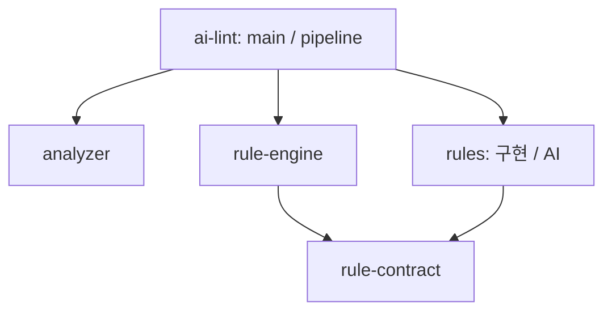

# ADR 0003: Cargo crate로 의존성 경계 제한

상태: 채택

## 배경

폴더와 모듈만 나누면 같은 crate의 다른 구현을 다시 참조할 수 있다.
분석기, 룰 계약, 엔진, 룰 구현을 독립적으로 확장할 수 있도록 Cargo 의존성을 분리한다.
이 결정은 [ADR 0002](0002-rust-only-rules.md)의 컴파일되는 Rust 규칙 방식을 유지하며 소스 위치를 변경한다.

## 결정

- `crates/analyzer`는 다른 프로젝트 crate에 의존하지 않는다.
- `crates/rules/contract`는 공통 룰 인터페이스와 입출력 타입을 소유하며 다른 프로젝트 crate에 의존하지 않는다.
- `crates/rule-engine`은 프로젝트 내부에서 계약 crate에만 의존한다. 분석기·룰 구현·AI 클라이언트를 참조하지 않는다.
- `crates/rules`도 계약 crate에만 의존한다. 룰 선택은 `Vec<Box<dyn Rule>>`를 반환한다.
- 루트 `ai-lint`가 이들을 조합한다. `main`이 실행 순서와 AI 클라이언트를 소유하고,
  `pipeline::rule_input`은 분석 결과를 엔진 입력으로 변환한다.
- 여러 crate를 함께 쓰는 통합 테스트는 루트 `tests/`에 둔다. 개발 의존성으로 경계를 우회하지 않는다.

의존성 방향은 다음과 같다. 화살표는 Cargo 의존성을 뜻한다.



## 검증과 영향

컴파일러가 Cargo에 선언되지 않은 crate 참조를 거부한다.
`tests/architecture.rs`는 workspace crate 사이의 허용된 의존성을 검사하므로,
금지된 의존성을 Cargo.toml에 추가해도 `cargo test --locked`가 실패한다.
새 crate나 의존성 방향을 도입하려면 이 결정과 경계 테스트를 함께 검토한다.

루트는 기존 `ai_lint::analyzer`, `ai_lint::rule_engine`, `ai_lint::rules` 경로를 재공개한다.
계약은 `ai_lint_rule_contract`로 직접 사용하거나 `ai_lint_rules::contract`로 접근한다.
독립 crate의 타입끼리는 루트에서 `From`을 구현할 수 없으므로 변환 함수를 사용한다.
`rules::default_engine`은 `rules::default_rules`로 바뀌며 엔진 생성은 호출부가 담당한다.
CLI 이름·옵션·출력·종료 코드는 유지한다.

```sh
cargo test --locked --offline
cargo fmt --all -- --check
cargo clippy --workspace --all-targets --locked --offline -- -D warnings
```
